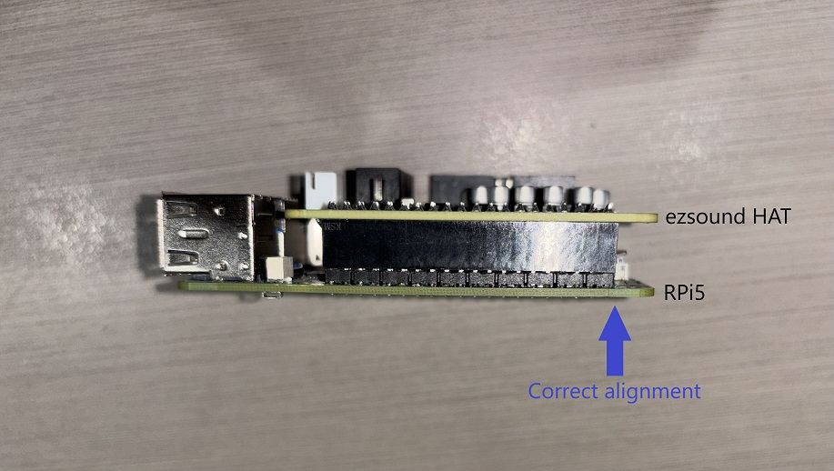
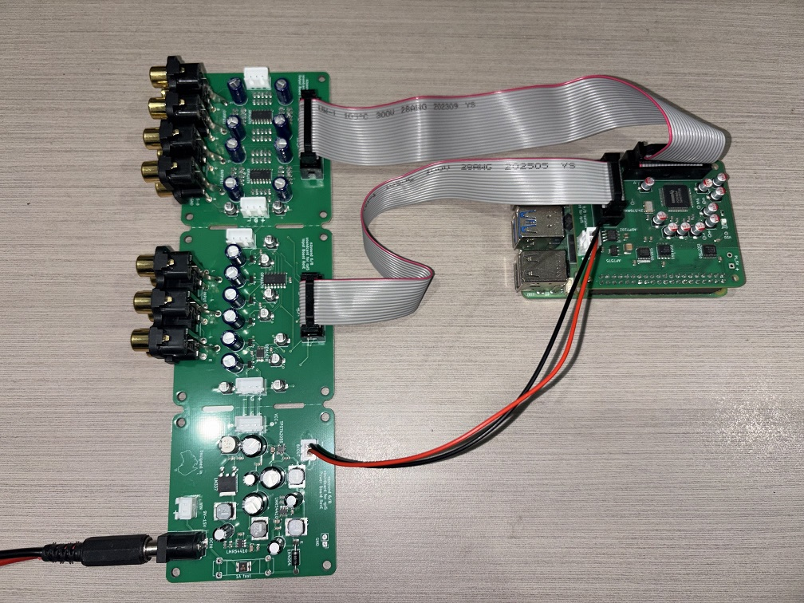
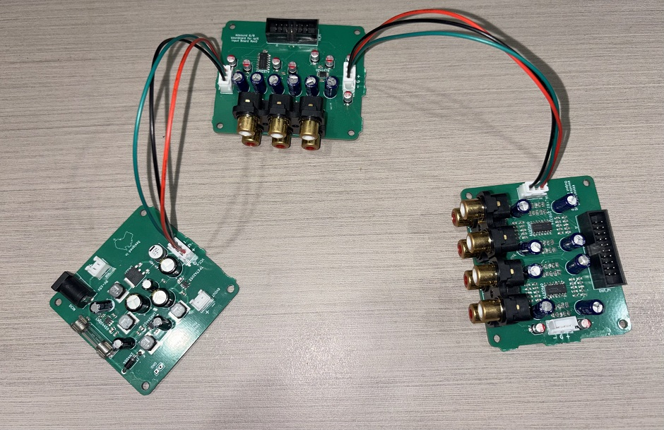

This repo contains files related to the ezsound 6x8 isolated soundcard.

# PHYSICAL CARD INSTALLATION

Before installing, check the card requirements below to confirm your Raspberry Pi is configured correctly.

1. Install the HAT (the smaller board) on your Raspberry Pi. Be sure to orient it correctly and check that the pins are aligned properly. **WARNING**: It is possible to accidentally install the board one pin to the left/right, or around the wrong way. If power is applied when installed incorrectly, this can cause permanent damage.

2. Use the supplied 2-wire cable to connect 6VOUT on the I/O board to 6VIN on the HAT.
3. Use the supplied 14-pin and 20-pin IDC cables to connect the HAT to the I/O board.
4. Connect a 9-15V DC supply to the I/O board's power input (+ve centre barrel jack). The soundcard requires less than 0.5A.

5. Turn on the power supply first, and then the Pi. If you started the Pi before applying power to the board, you can use `reprobe.sh` from this repository to enable the sounodcard.

Note that the supplied 3-way cables are only needed if you separate the sections of the I/O board (see below).

# SEPARATING THE I/O BOARD SECTIONS

The three sections of the I/O board are designed so that you can easily separate them if needed. Just cut along the dashed lines with a rotary tool or fine-toothed hand saw. You should wear a mask while doing this, as the PCB material can be harmful if inhaled. Once the sections are separated, you will need to provide power to each section by connecting the supplied 3-way cables.

# CARD REQUIREMENTS:

The card requires a Raspberry Pi 5 or Compute Module 5, as these models are the only ones with an 8-channel I2S sound interface.

1. Confirm that your `/boot/firmware/config.txt` contains `dtparam=i2c_arm=on`. When enabled properly, the file `/dev/i2c-1` will exist.
2. Confirm that your `/boot/firmware/config.txt` contains `dtparam=i2s=on`.
3. Ensure that you have a 6.12.x Linux kernel or greater using `uname -r`.

Everything should work automatically if the above requirements are met.

# CHECKING FOR CARD PRESENCE

`aplay -l` and `arecord -l` should both show a card called `ezsound6x8`.

# UTILITIES:

* `reprobe.sh`: If the card did not have power when the Pi was booted, then it will not have been detected. This script can be run as root to scan for the card. Once it is detected, you can use it as normal.
* `runtests.sh`: This script shows examples of various things you can do with basic ALSA utilities. Use `runtests.sh -h` to get a list.

# OTHER FILES:

`Makefile`, `ezsound-6x8.conf`: It should never be necessary, but you can flash the card's EEPROM by running `make flash` (the board comes with write protection enabled using a solder jumper). This will run commands as root - make sure you understand what it is doing. You will need `cmake` installed on your system for this to work.
